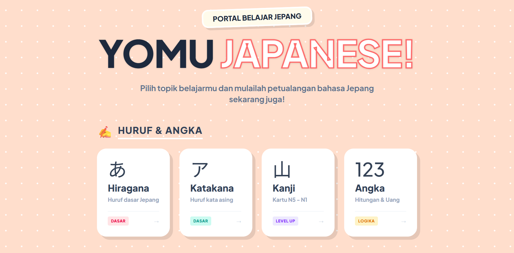

  <h1>
    
     
    Yomu Japanese (読む)
  </h1>

  <h3>Interactive Japanese Learning App with a Vibrant & Modern UI</h3>

  
  

<h2>🌸 Description</h2>

  

  <strong>Yomu Japanese</strong> is your Japanese learning companion, designed to be <em>fun</em> and far from boring. Forget stiff, heavy textbooks! Here, you'll embark on a visual adventure—mastering basic scripts (Hiragana & Katakana), memorizing N5-N1 Kanji, and conquering thousands of thematic vocabulary words, from "Bento Box items" to "Animal Safari".

  Built as a <strong>PWA (Progressive Web App)</strong>, Yomu can be installed directly on your phone without hassle, ready to accompany your learning anytime and anywhere, even when offline!

<h2>📚 Content List</h2>

<h3>1. Characters & Numbers</h3>
<ul>
  <li>あ <strong>Hiragana</strong> — Basic Japanese Scripts</li>
  <li>ア <strong>Katakana</strong> — Script for Foreign Words</li>
  <li>山 <strong>Kanji</strong> — N5 - N1 Flashcards</li>
  <li>123 <strong>Numbers (Suuji)</strong> — Counting & Currency</li>
</ul>

<h3>2. Vocabulary</h3>
<ul>
  <li>🍱 <strong>Kotoba</strong> — Colors, Days, Time</li>
  <li>📦 <strong>Mono</strong> — Daily Objects</li>
  <li>🏃 <strong>Verbs (Doushi)</strong> — Actions & Basic Conjugation</li>
  <li>✨ <strong>Adjectives (Keiyoushi)</strong> — I-Adj & Na-Adj</li>
  <li>💼 <strong>Professions (Shigoto)</strong> — Jobs & Careers</li>
  <li>🍜 <strong>Food (Tabemono)</strong> — Meals, Drinks & Tastes</li>
  <li>🐯 <strong>Animals (Doubutsu)</strong> — Land, Sea, and Air</li>
  <li>🚄 <strong>Transport (Norimono)</strong> — Vehicles & Traffic</li>
  <li>🏢 <strong>Buildings (Tatemono)</strong> — Public Facilities</li>
  <li>🍓 <strong>Fruits (Kudamono)</strong> — Fresh Fruits</li>
  <li>🌿 <strong>Plants (Shokubutsu)</strong> — Trees & Flowers</li>
  <li>🤒 <strong>Health (Byouki)</strong> — Illness & Symptoms</li>
</ul>

<h3>3. Grammar</h3>
<ul>
  <li>🏗️ <strong>Bunpou</strong> — Basic Sentence Patterns</li>
  <li>🔗 <strong>Particles (Joshi)</strong> — Wa, Ga, Wo, Ni, De</li>
  <li>💬 <strong>Greetings (Aisatsu)</strong> — Daily Conversation Phrases</li>
  <li>📜 <strong>Idioms</strong> — Kanyouku & Yojijukugo</li>
</ul>

<h2>🛠️ Tech Stack</h2>
<ul>
  <li><strong>Framework:</strong> Vue 3</li>
  <li><strong>Build Tool:</strong> Vite</li>
  <li><strong>Styling:</strong> Tailwind CSS v4</li>
  <li><strong>PWA:</strong> Vite Plugin PWA</li>
  <li><strong>Routing:</strong> Vue Router</li>
</ul>

<h2>🙏 Credits & Resources</h2>

  Special thanks to these amazing resources for providing data and references:

<ul>
  <li><a href="https://kanjikana.com" target="_blank"><strong>Kanjikana</strong></a></li>
  <li><a href="https://jlptsensei.com" target="_blank"><strong>JLPT Sensei</strong></a></li>
</ul>
